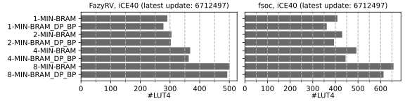
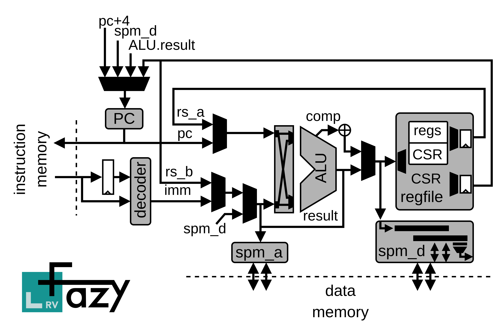

# FazyRV -- A Scalable RISC-V Core

A minimal-area RISC-V core with a scalable data path to 1, 2, 4, or 8 bits and manifold variants.

## Table of Content
- [Introduction](#intro)
- [Design Variants](#vars)
- [Quick Start](#quick)
    - [Reference SoC](#fsoc)
    - [Litex](#litex)
- [Tests and Verification](#verif)
    - [riscv-tests](#riscvtests)
    - [RISCOF](#riscof)
    - [Module-Level Formal Checks](#formal)
    - [riscv-formal](#riscv-formal)
- [Benchmarks](#benchmarks)
    - [Embench](#embench)
- [Decoder](#decoder)
- [Design Insights, Evaluation, and Results](#results)
- [TODOs](#todos)

## Introduction <a name="intro"></a>

FazyRV is a minimal-area RISC-V RV32 core with inherent scalability. The data path can be set to a width of either 1, 2, 4, or 8 bits to process smaller _chunks_ of the operands each clock cycle. Scaling the chunk size allows a trade-off between area and performance at synthesis time. Moreover, each chunk size can be combined with manifold variants to find the best-fitting configuration and trade-off for given system requirements and technology. In contrast to other approaches, FazyRV tries to avoid manual optimization at the gate level (see also [Decoder](#decoder)).

### Area / Resource Demand

The plot below tracks the resource demand of the FazyRV core (left) and a minimal reference SoC (right) for an iCE40 architecture. Note that only a few variants are plotted for brevity.

<p align="center">
  
</p>

### Organization

FazyRV is contained in `rtl` and licensed under a permissive MIT license.
`rtl/fazyrv_top.sv` is the top module and instantiates the FazyRV core (`rtl/fazyrv_core.sv`) alongside the register file. The reference SoC (fsoc) is located in `soc/rtl` along with a constraint file for common architectures.


The data flow through the core can be outlined as follows:
<p align="center">
  
</p>


### Acknowledgement

<p>
  
  
  
</p>


This repository includes results of research in the [Embedded Architectures & Systems](https://iti.tugraz.at/eas) (EAS) Group at [Graz University of Technology](https://www.tugraz.at). 

&nbsp;

## Design Variants <a name="vars"></a>

`CHUNKSIZE` sets the data path width of FazyRV and, thus, primarily determines the required Cycles per Instruction (CPI). When the chunk size is set to 1, a single bit is processed per clock cycle, and an addition, e.g., requires 32 cycles (without fetch and decode) to process the operands. It reduces to 4 clock cycles when 8 bits are processed simultaneously, i.e., `CHUNKSIZE = 8`. The latter variant, however, comes with an increased area demand.

```
CHUNKSIZE   := 1 | 2 | 4 | 8
```

The configuration (`CONF`) determines the functionality of the core. In the `MIN` variant, no interrupts are supported and the core implements to the minimal area achievable. The work-in-progress `INT` variant adds basic interrupt support but sacrifices many features in favor of reduced area. Thus, e.g., `mtvec` can only be set at synthesis time. Finally, the work-in-progress `CSR` variant adds more CSR registers and allows reading and writing them. However, there are deviations from the specification as area remains a main optimization objective.

```
CONF        := MIN | INT | CSR
```

The register file type (`RFTYPE`) influences both the area and the performance. It selects how registers are implemented in FazyRV. The most area-intensive option is `LOGIC`. It implements the registers in logic elements such as LUT RAM or FF RAM. Due to the large area, this option is primarily used for testing purposes and _cannot_ be combined with all variants. `BRAM` implements the register file in block RAM with a single read port. Thus, operands must be fetched sequentially, leading to a performance decrease compared to a dual-port RAM implementation (`BRAM_DP`). The `BP` variants `BRAM_BP` and `BRAM_DP_BP` additionally instantiate a bypass multiplexer to make the operands accessible to the core one cycle in advance. While this improves the performance due to the saved clock cycle per instruction, more area may be consumed.

```
RFTYPE      := LOGIC | BRAM | BRAM_BP | BRAM_DP | BRAM_DP_BP
```

In the default configuration, FazyRV interfaces the memory with a Wishbone interface. `MEMDLY1` allows deviation from the handshake and assumes that each access is directly granted with a one-clock cycle delay until the access is completed and the results are available. This can lower the average CPI when the design ensures the above conditions are met, e.g., when the memory is implemented in BRAM.

```
MEMDLY1     := 0 | 1
```

> [!IMPORTANT]  
> Please note that the core still needs to become production-ready. As there is a strong focus on area, the implemented features in the `INT` and `CSR` variants and allowed deviations from the specification must be carefully considered. Also, note that the `LOGIC` variant is explicitly not considered with `INT` and `CSR` variants. 

## Quick Start <a name="quick"></a>

### Prepare the Environment

You may want to use a Python virtual environment. 

```shell
python3 -m venv .venv
source .venv/bin/activate
pip install -r requirements.txt
```

### Reference SoC <a name="fsoc"></a>

fsoc (`soc/fsoc`) is a minimal SoC used to track the core's area demand and run simulation-based tests and benchmarks. The Make targets for the reference implementations are based fusesoc (for most FPGA architectures). `fazyrv.core` and `fsoc.core` core files for FazyRV and fsoc, respectively.

Start by adding core files to the fusesoc library.

```shell
fusesoc library add fazyrv .
fusesoc library add fsoc .
```

Then, you can use the targets in the core file or run the flow with the Make targets below. A reference implementation for the following architectures is supported. Replace `<ARCH>` with the desired target architecture (see below). Also, replace `<CHUNKSIZE>`, `<CONF>`, and `<RFTYPE>` with the desired values.

```
ARCH        := ice40 | ecp5 | gowin | xilinx | gatemate
```

```shell
# run the flow only
make _impl.soc.<ARCH>-<CHUNKSIZE>-<CONF>-<RFTYPE>

# run the flow and report a summary of the results
make _report.soc.<ARCH>-<CHUNKSIZE>-<CONF>-<RFTYPE>

# e.g.,
make _report.soc.ice40-8-MIN-BRAM

# or 
make report.soc.all
```

### Litex <a name="litex"></a>

[LiteX](https://github.com/enjoy-digital/litex) supports FazyRV with the following options: `--cpu-chunksize` to set the chunk size (`1`, `2`, `4`, or `8`), `--cpu-conf` to set the configuration (`MIN`, `INT`, or `CSR`) and `--cpu-rftype` to set the register file type (`LOGIC`, `BRAM`, `BRAM_BP`, `BRAM_DP`, or `BRAM_DP_BP`).

```shell
litex_sim --cpu-type=fazyrv --cpu-chunksize=4 --cpu-rftype=LOGIC
```

## Tests and Verification <a name="verif"></a>

### Run riscv-tests <a name="riscvtests"></a>

riscv-tests are used as fast checks to get feedback if a variant is broken. However, the tests are not as sensitive as the RISCOF tests and may report false positives.

Execute the tests with the make target below by replacing the `<CHUNKSIZE>`, `<CONF>`, and `<RFTYPE>` with the desired variant or run it on all variants.

```shell
# riscv-tests
make sim.riscvtests.<CHUNKSIZE>-<CONF>-<RFTYPE>
# e.g.,
make sim.riscvtests.8-MIN-BRAM
# or
make report.riscvtests.all
```


### Run RISCOF <a name="riscof"></a>

The RISCOF framework provides more extensive simulation-based design tests. You can run the test either for one variant or use `riscof.all` to run  the tests for a selected subset of all variants.

```shell
# RISCOF
make riscof.prepare
make riscof.run.<CHUNKSIZE>-<CONF>-<RFTYPE>
# e.g.,
make riscof.prepare
make riscof.run.8-MIN-BRAM
# or
make riscof.prepare
make riscof.all
```

### Module-Level Formal Checks <a name="formal"></a>
The ALU (`rtl/fazyrv_alu.sv`) and the `spm_d` module (`rtl/fazyrv_spm_d.sv`) are checked by BMC in a formal test bench. The test benches and `.sby` files are located in `fv/alu` and `fv/spm_d`, respectively. These were primarily used to support a formal verification test-driven development when the core was not ready to be checked by `riscv-formal`. However, they remain important to verify changes and optimizations. The chunk size is set to 8 by default. If required, please update the local parameter `parameter CHUNKSIZE` in the formal test benches accordingly.

```shell
# alu
cd fv/alu
sby -f fazyrv_alu_bmc.sby
sby -f fazyrv_alu_cov.sby

# spm_d
cd fv/spm_d
sby -f fazyrv_spm_d_bmc.sby
sby -f fazyrv_spm_d_cov.sby
```

### riscv-formal <a name="riscv-formal"></a>

In addition to simulation-based tests, formal checks are applied using riscv-formal. Due to the exponential run time, formal checks are primarily considered for larger chunk sizes. Also, the depth is limited. 

```shell
# insn checks
make fv.rvformal.bmc.insn.<CHUNKSIZE>
make fv.rvformal.cov.insn.<CHUNKSIZE>

# reg checks
make fv.rvformal.bmc.reg.<CHUNKSIZE>
make fv.rvformal.cov.reg.<CHUNKSIZE>

# e.g.
make fv.rvformal.bmc.insn.8 && make fv.rvformal.cov.insn.8

# or run them sequentiall on all chunk sizes
make fv.rvformal.bmc.insn.al
make fv.rvformal.bmc.reg.all
make fv.rvformal.cov.insn.all
make fv.rvformal.cov.reg.all
```

## Benchmarks <a name="bench"></a>

### Embench <a name="embench"></a>

Embench is used to benchmark FazyRV and compare it to similar minimal-area cores. It can be run via a Make target.

```shell
make embench.run
```

The target calls the shell script `script/benchmark_run_embench_all.sh`. Please adapt it to run the benchmark suite on the desired variants. `--insn_timing` is used to store information about all executed instructions on the disk. It can be used to analyze and compare the cycles per instructions (CPI). Note that this significantly increases the required disk space.


## Decoder <a name="decoder"></a>

FazyRV is written at a Verilog RTL abstraction level that remains human-readable. Thus, hand-optimization at the gate level is avoided whenever possible. However, some parts of the design benefit from optimization at a lower level, such as the combinational logic in the instruction decoder. Thus, the decoder is given in a table-like format that can be fed into the ESPRESSO logic optimizer to generate an optimized gate-level description. The input file (`optimizer/decoder/decoder`) can be edited efficiently. The instruction bits can either be checked explicitly or set to _don't care_ when they are not required to interpret legal instructions. The former has more freedom to optimize to a smaller implementation but is more insecure when illegal instructions appear.

```shell
espresso -o eqntott -Dso_both ~/Documents/public_repos/FazyRV/optimizer/decoder/decoder > tmp
```

The output gate-level Verilog code can then be updated in the decoder implementation (`rtl/fazyrv_decode.sv`).

A simple fuzzing script is used to estimate the optimization potential of the decoder. It iteratively sets bits to _don't care_ and tests the modification. First, riscv-tests are run to find broken decoders quickly and shorten the overall run time. When the riscv-tests pass, a riscv-formal formal verification run is started on the insn checks for the 8-bit variant. Then, the modification is either reverted or the _don't care_ is kept. The fuzzer is **solely for testing purposes**. It is _not_ recommended to take over the optimized result. The final decoder must be carefully checked and thoroughly verified on all variants before using it in the core. Please note that the current version only tests one bit at a time and may be improved.

```shell
cd optimizer/decoder/decode_opt
python3 fuzz.py --espresso_file ../decoder --riscvtests_dir ../../../sim --riscvformal_dir ../../../ --template_verilog fazyrv_decode.template --template_marker "//<PUT_IT_HERE>" --destination_verilog ../../../rtl/fazyrv_decode.sv --espresso_optimized espresso.optimized
```

## Design Insights, Evaluation, and Results <a name="results"></a>

> [!TIP]
> This work will be presented at the Computing Frontiers 2024 conference. A research paper containing our design objectives, an insight into the design and trade-offs, a comparison with similar cores, and an in-depth evaluation will be **available soon**.

## TODOs <a name="todos"></a>

- [ ] Workflow: caching, tool versions, artifacts, dependence on some local tools
- [ ] RVC extension (compressed instructions)
- [ ] INT variant
- [ ] CSR variant
- [ ] CSR instructions in addition to `csrrw`(?)
- [ ] Use edalize reporting instead of custom scripts
- [ ] Optimization
- [ ] More documentation

Please feel free to discuss and open an issue and/or pull request.

## Licensing

The FazyRV core (`rtl/*`) is licensed under the MIT license. This license may _not_ apply to the remainder of the repository.